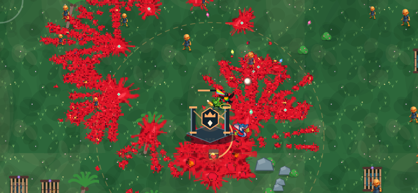

# Crownfall — build 6

The main run is now a raid through three Crown Engines. The player gathers a
squad, overfeeds each engine with stolen souls, defeats its keeper and chooses
a stolen power. Destroying all three brings out King Glob. The old six-minute
wait no longer controls the default run's finish.

## The playable loop

1. Start with a powershot ready. A rescue sits on the approach to the first engine.
2. Follow the coloured diamond to the active engine. Kills inside its dashed
   ring fill its soul quota; a keeper must also be defeated. Progress stays if
   the player retreats. Killing enemies elsewhere still earns XP and Fury.
3. The completed engine explodes, clears nearby enemy bullets, restores 25% HP,
   refills squad blasts and awards 35 bonus shells, banked at the end of the run.
4. Combat pauses for a choice of three stolen powers. The selected power lasts
   this raid. Each choice unlocks the next engine; all three choices unlock Glob.
5. Defeat Glob to see the ending and bank progression. Retry starts a new raid
   with the same setup. Endless and Daily retain their timed boss structure.

| Engine | Keeper | Crownfall soul quota | Blitz quota |
|---|---|---:|---:|
| The Ember Kiln | Demonder: closes into melee | 26 | 16 |
| The Drowned Choir | Spitter: strafes and fires a spread | 42 | 28 |
| The Hollow Spire | Clubbo: a large, durable close-range threat | 60 | 40 |

Ordinary enemies count as one soul and elites as three. A keeper can be killed
before or after reaching the quota. Keeper spawns obey the performance preset
enemy limit and retry if the pool is full. Keeper identities reset when enemy
slots are reused, and keepers are not silently despawned by distance.

Layout and later power choices are seed-driven. The first engine reward always
offers Double Detonation, Chain Reaction and Crown Armour. Later offers exclude
owned powers and rotate through the remaining pool. Three new engine images
and a keeper aura are cached Canvas drawings using the existing visual system.

## Fury and the blast economy

Nearby kills give four Fury; elites give 18. Kills within 650 world units count.
After 2.5 seconds without a kill, Fury drains at five points per second. At
100 Fury, an eight-second Rampage grants a ready blast, adds 34% charge per
second before the charge multiplier, and speeds dash recovery. Outside Rampage,
the controlled Guardian gains 4.5% charge per second plus charge from damage.

Rampage duration does not extend on kills. It ends with a four-second recovery
before Fury can build again. These rules are global to the raid: switching
Guardians cannot reset the timers. Rescues bring a fully charged Guardian into
the squad, so possession is another way to access a blast.

Powershots have a shared 0.8-second lock in raids. Damage dealt during that lock
does not refill a powershot. Damage credited towards mastery and charge is
also capped at the target's remaining HP: excess damage against a nearly dead
enemy can no longer manufacture mastery or recharge.

| Stolen power | Behaviour |
|---|---|
| Double Detonation | A powershot leaves a second blast after 0.35 seconds, at 55% initial shockwave damage and 85% radius |
| Chain Reaction | Every six nearby kills detonates a corpse; these extra blasts cannot feed another chain |
| Crown Armour | 15% less incoming damage; every powershot restores a one-hit shield |
| Demolition Dash | Leave a bomb at the dash origin, detonating after 0.3 seconds; dash cooldown is multiplied by 0.6 |
| Redline | 35% more Fury per kill and a ten-second Rampage |
| Soul Harvest | Every 12 nearby kills restores 6% max HP and attracts nearby gems for 1.8 seconds |

Extra blasts use an eight-entry queue and execute at most two per update.
They use the existing damage, blood, fragment, explosion and bounded audio
systems. Engine destruction adds one separate blast at each of the three
objective completions. The three cached engine textures occupy about 619 KiB
of RGBA pixels; the 96×96 keeper aura adds 36 KiB. Browser overhead is additional.

## Story and feedback

Glob's crown drains an island's warmth, songs and magic through three engines.
The horde carries that stolen power; killing it near an engine overloads the
machine. The mechanics are the means of taking the island back.

The opening story introduces the empty cage, the three engines and the raid.
Each completed engine returns part of the island's life and a power to the
squad. The victory ending restores the village fires and harbour songs. The
defeat ending carries the rebellion into another attempt.

The active goal stays in the existing top HUD. Fury sits beneath the player's
health and XP. Engine rings, radial progress, a diamond guide and radar marks
provide world guidance. The pause journal contains chapter context and the
chosen powers. Story does not create floating combat messages or timed banners.
Engine rewards use deliberate, paused choice screens, like the existing upgrade
drafts. The existing gore and impact audio remain in use.

Save version 5 adds Crownfall clears, best engine progress and discovered powers.
Existing Guardians, mastery, shells, perks and records are retained. The home
screen displays crowns broken and stolen powers discovered. Raid records are
banked once through the existing end-of-run save path.

## Validation and preview

[Watch the Canvas gameplay capture](docs/crownfall-gameplay.mp4).



The capture runs the actual game, sprites, movement, attacks, enemy AI and gore
with a scripted player through native Canvas at 844×390. It omits the HTML HUD
and audio; it is not a browser or phone recording.

```sh
node --test tools/test/*.test.js
node tools/test/simulate-raid.cjs 0
NODE_PATH=/path/to/node_modules node tools/test/render-crownfall.cjs
bash tools/build.sh
```

The test suite contains 60 automated tests, including the existing combat,
gore, audio and offline-update regressions. New checks cover local objective
credit, keeper requirements, three-engine completion, reward buttons, duplicate
and stale choices, Fury expiry, chain limits, actual delayed damage, saving,
retrying, enemy pool saturation, overkill and boss arrival conditions.

A scripted Bo run on Guardian difficulty completed all three engines and the
boss using normal movement, attacks and upgrades: 129.8 seconds of simulation,
841 kills, seven Rampages and 42 powershots. This is a functional balance smoke
test; it does not predict human completion time, enjoyment or retention.

Browser layout, physical touch input, phone frame rates and subjective gameplay
remain unverified. The production build remains approximately 30 MiB and adds
no runtime dependency. Preview media and QA tools are excluded from deployment.
The app and its atomic offline shell both identify this build as
**CROWNFALL · BUILD 6**.
