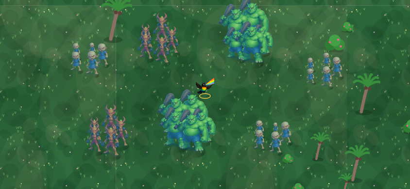
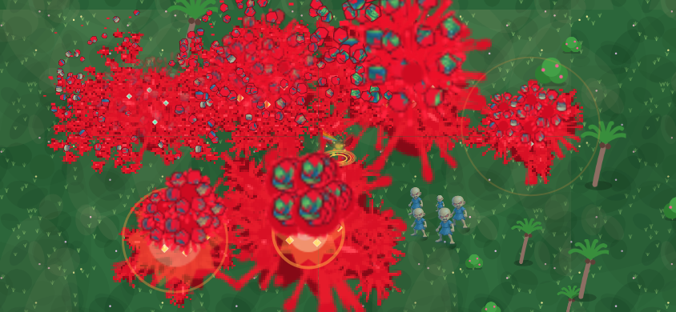
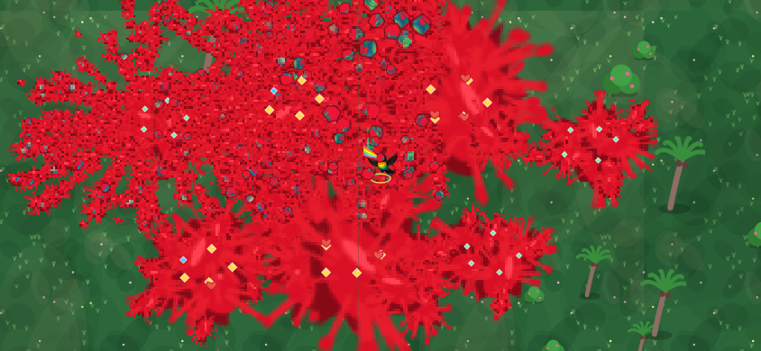

# Red splatter — build 4

The previous death effect was too subtle. Its maroon stains blended into the
terrain, bright weapon effects covered airborne blood, and the first few
kills could exhaust the entire flying-particle budget. Damage and combo
labels also still floated over combat after banners were removed.

This update makes the requested gore unmistakable: scarlet ground splashes,
long red jets and droplets, six pieces cut from each enemy's actual artwork,
spinning body chunks, blood trails and persistent landed remains. Explosions
throw extra fragments away from their centre. Stains cover scenery; enemy
bullets render above the airborne gore. The existing simplified blasts,
reduced scenery, disabled full-screen lighting and particle caps stay in use.

## Actual combat renderer

These captures run `game.js` and the existing sprite loader at 844×390 through
native Canvas, with a controlled group of 35 enemies and successive explosions.
DOM and audio are simulated; these are combat-renderer captures, not browser
screenshots or phone FPS measurements. The HTML HUD is not included.

Before the explosions:



During the explosions:



After the explosions:



Reproduce with an optional `@napi-rs/canvas` installation available on `NODE_PATH`:

```sh
node tools/test/render-gore.cjs
```

The preview PNGs and QA tools are excluded from the production build.

## Rendering and limits

A 512×256 atlas holds puddles, fallback fragments and eight blood-burst frames.
At the start of a run, up to 19 enemy variants each get a 192×144 sheet of six
body fragments in eight rotations, plus a 512×64 breakup animation. All art
comes from the existing enemy sprites and native Canvas drawing; no new
runtime dependency, external image request or downloaded gore asset is needed.

Each visible death receives an independently pooled breakup animation. One
cached blit shows six pieces separating amid a red spray even when the flying
particle budget is exhausted. When this pool also fills, the oldest animation
is replaced so a new kill still registers. Flying body chunks and droplets use
a separate fixed pool; landed blood and pieces are baked into sparse ground
tiles. Neither system consumes the gameplay random stream.

| Preset | Breakup animation cap | Flying fragment cap | New flying fragments per update | Ground tile cap | Cosmetic effect cap | Maximum gore texture pixels, RGBA |
|---|---:|---:|---:|---:|---:|---:|
| High | 320 | 320 | 128 | 64 | 80 | 8.88 MiB |
| Balanced | 240 | 240 | 96 | 48 | 56 | 7.88 MiB |
| Battery saver | 160 | 160 | 64 | 32 | 36 | 6.88 MiB |
| High performance | 120 | 120 | 48 | 24 | 24 | 6.38 MiB |

Texture figures include all 19 cached body variants and the blood atlas,
excluding browser/driver overhead. The body sheets account for 4.38 MiB and
are reused across runs. Ground tiles are 128×128 pixels covering 512 world
units, drawn once per occupied visible tile regardless of stain count. Distant
tiles are recycled when the cache fills. Nearest-neighbour ground sampling
avoids translucent seams between tiles at fractional camera positions.

The queue holds at most 256 stamps. Carnage paints at most 24 per update;
Light paints at most 12. Optional satellite splashes and blood trails leave
queue space for new deaths. Normal and explosive kills request 18/30 flying
fragments in Carnage, 6/9 in Light; bosses request 54/18. Body-breakup sprites
last 0.52 seconds (0.38 in Light). Reduced motion retains static blood without
airborne gore; Off clears all remains and active animations immediately.
Retry clears both pools, stains and pending texture writes. Damage, kills,
XP and rewards remain independent of every cosmetic cap.

## Clear combat view and updates

All floating damage, critical, combo, healing, ward and charge text is removed,
including the old Damage numbers setting. Existing saved number preferences
cannot re-enable it. Banner and coach elements and their unused styles are
gone. Important progress remains in the fixed HUD, menus and recap; recent
announcements are available only in Pause's collapsed Recent action log.
Upgrade choices still function. Tide shifts, wind drift and the other removed
environmental events remain removed.

Settings calls Full gore **Carnage** (the saved value is still `full`) and shows
**RED SPLATTER · BUILD 4** so the installed version is identifiable. Saves,
unlocks, currency and explicit gore/motion preferences are preserved.

HTML, CSS and script URLs identify this release. Service worker installation
bypasses the HTTP cache and only activates after the complete shell is cached.
Navigations check the network but only accept HTML matching the active build;
a newer entry triggers a worker update and waits for its matching assets. The
current entry remains available offline. Update checks bypass the worker's
HTTP cache. Controller changes refresh a visible menu after saving, while
active runs, paused runs and upgrade choices defer refresh. First installation
does not reload the game. No update toast or combat popup is added.

After this PR is merged and Pages deploys, reopen the game. For a tab still
running an older worker, opening `?build=4-red-splatter` on the game URL also
bypasses its previously cached navigation. Verify the build label in Settings.
The patch does not erase browser storage to update the game.

## Verification

- All 36 rules, simulation and update regressions pass, including the existing
  24-Guardian smoke test and production asset references.
- Stress tests cover 9,000 synthetic deaths, repeated 120-enemy explosions on
  all four quality presets, later deaths with a saturated particle pool,
  bounded body caches, and identical combat rewards across gore settings.
- Render-path tests verify no combat text with legacy `dmgnum: all` saves;
  settings, retry and reduced motion clear the additional breakup pool.
- Worker tests cover complete/partial installation, cache versioning, online
  refresh, offline fallback, avoiding mixed releases, safe deferred reload and
  first-install behavior. These use simulated worker/browser ports.
- Production build, JavaScript syntax checks and native Canvas visual inspection
  pass. Browser touch input, real offline lifecycle behavior and phone frame
  times still require device testing; no measured phone FPS improvement is claimed.

## Technical references

W. T. Reeves (1983), *Particle Systems—a Technique for Modeling a Class of
Fuzzy Objects*, ACM Transactions on Graphics 2(2), 91–108,
[DOI 10.1145/357318.357320](https://doi.org/10.1145/357318.357320).
Peer reviewed. **Credibility: 9/10** for the particle-lifecycle model, not for
performance claims about this implementation or modern phones.

[W3C Service Workers specification](https://www.w3.org/TR/service-workers/).
Primary web-platform specification. **Credibility: 10/10** for Cache/addAll,
installation and updateViaCache semantics; it is not a peer-reviewed game
performance study. Pool sizes, visual intensity and update integration here
are implementation choices validated to the extent described above.
